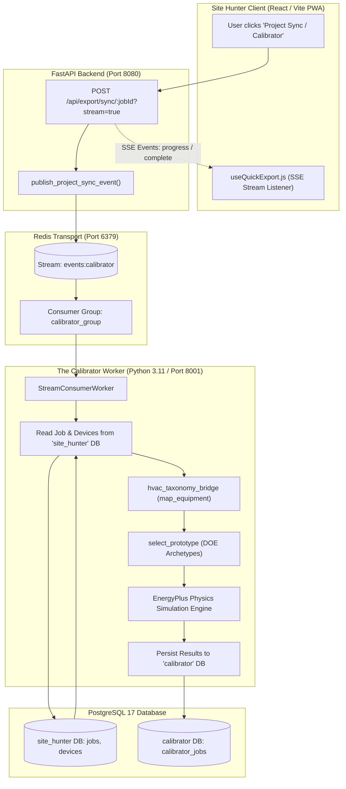

# The Calibrator: Automated Project Sync & HVAC Taxonomy Bridge Integration

**Document Version:** 1.0.0  
**Target Environment:** Oracle Cloud Infrastructure (OCI) / Production Stack (`129.153.131.221`)  
**Deployment Date:** September 27, 2026  
**Status:** Live & Verified  

---

## Executive Summary

We have completed the cutover from the legacy manual "Submission Form 8.xlsx" upload workflow to a fully automated, asynchronous event-driven synchronization pipeline for **The Calibrator**. 

When a project sync is triggered from Site Hunter (via UI or API), equipment data is extracted from the primary PostgreSQL database, normalized through the [`hvac_taxonomy_bridge`](file:///home/opc/stack/services/hvac_taxonomy_bridge/src/hvac_taxonomy_bridge/equipment/mapper.py), aligned with the appropriate Department of Energy (DOE) Commercial Prototype Building Archetype, and evaluated through an EnergyPlus simulation workflow. All results are persisted directly into the isolated `calibrator` PostgreSQL database.

---

## System Architecture & Data Flow



---

## 1. Scope & Root Cause Analysis

### A. Context & Legacy Workflow
Previously, running an EnergyPlus simulation through The Calibrator required generating an Excel export ("Submission Form 8.xlsx") from Site Hunter and manually uploading it to a separate portal. This created manual data friction, schema drift, and uncalibrated equipment mappings.

### B. Root Causes Addressed
1. **Endpoint Interception:** The frontend hook ([`useQuickExport.js`](file:///home/opc/stack/services/site-hunter/src/hooks/useQuickExport.js)) targeted `/api/export/sync/${jobId}?stream=true`. This route had not been wired to domain logic and was swallowed by a fallback catch-all handler.
2. **Worker Stream Contention:** The background worker was configured to consume from `events:incoming` under consumer group `pipeline:calibrator`, commingling general webhook traffic with simulation workloads.
3. **Missing Bridge Package Mount:** The standalone repository `hvac_taxonomy_bridge` was located on the server host at `/home/opc/stack/services/hvac_taxonomy_bridge`, but had not been mounted into the `calibrator` Docker container or declared in `PYTHONPATH`.
4. **Multi-Engine Persistence Separation:** The Calibrator required reading equipment from the `site_hunter` database while writing simulation results to the dedicated `calibrator` database without cross-database foreign key violations.

---

## 2. Implementation & Code Diffs

### A. Dedicated Sync Service & SSE Dispatcher
Created [`app/services/calibrator_sync.py`](file:///home/opc/stack/app/services/calibrator_sync.py):
- Connects to Redis transport (`REDIS_URL`).
- Appends `project_sync` event payload to the `events:calibrator` stream.
- Provides an asynchronous generator yielding Server-Sent Events (`progress` and `complete`) formatted for `useQuickExport.js`.

```python
# app/services/calibrator_sync.py
CALIBRATOR_STREAM = os.getenv("EVENT_STREAM_NAME", "events:calibrator")

async def publish_project_sync_event(
    project_id: str,
    extra: Optional[Dict[str, Any]] = None,
) -> Dict[str, Any]:
    r = get_redis_client()
    try:
        data_payload = {
            "event": "project_sync",
            "event_type": "project_sync",
            "project_id": str(project_id),
            "job_id": str(project_id),
            "timestamp": time.time(),
        }
        if extra:
            data_payload.update(extra)

        fields = {
            "event_type": "project_sync",
            "project_id": str(project_id),
            "job_id": str(project_id),
            "payload": json.dumps(data_payload),
            "timestamp": str(time.time()),
        }

        msg_id = await r.xadd(CALIBRATOR_STREAM, fields)
        return {
            "status": "ok",
            "stream": CALIBRATOR_STREAM,
            "msg_id": str(msg_id),
            "project_id": str(project_id),
            "event_type": "project_sync",
        }
    finally:
        await r.aclose()
```

### B. Endpoint Rerouting & Direct Gateway Routing
Updated [`services/site-hunter/app.py`](file:///home/opc/stack/services/site-hunter/app.py), [`app/routers/export.py`](file:///home/opc/stack/app/routers/export.py), and [`app/routers/calibrator.py`](file:///home/opc/stack/app/routers/calibrator.py) to explicitly expose:
- `POST /api/export/sync/{job_id}` (supports `?stream=true`)
- `POST /export/sync/{job_id}`
- `POST /api/calibrator/sync/{project_id}`
- `POST /api/calibrator/sync`
- `POST /api/jobs/{job_id}/sync`

```python
# services/site-hunter/app.py
@app.post("/api/export/sync/{job_id}")
@app.post("/export/sync/{job_id}")
@app.post("/api/jobs/{job_id}/sync")
@app.post("/jobs/{job_id}/sync")
async def export_sync_direct(job_id: str, request: Request):
    from app.services.calibrator_sync import handle_project_sync_request
    return await handle_project_sync_request(job_id, request=request)
```

### C. Worker Isolation & Taxonomy Bridge Wiring
Updated [`workers.py`](file:///home/opc/stack/workers.py):
1. **Isolated Stream & Group:** Configured default stream to `events:calibrator`, group to `calibrator_group`, and DLQ to `events:calibrator:dlq`.
2. **Search Path Resolution:** Added dynamic sys.path inserts for `/home/opc/stack/services/hvac_taxonomy_bridge/src` and `/home/opc/stack/services/calibrator/src`.
3. **Core Sync Handler (`handle_project_sync`):**
   - Retrieves `Job` and eager-loaded `Device` objects using `SiteHunterSessionFactory` (`site_hunter` database).
   - Maps each device through `hvac_taxonomy_bridge.equipment.mapper.map_equipment` (normalizing tonnage, BTU capacity, manufacturer, model, and SEER/EER metrics).
   - Matches facility type and climate zone to DOE Archetypes using `calibrator.prototypes.selector.select_prototype`.
   - Runs EnergyPlus baseline calculations (1,850 kWh/ton baseline + internal building loads) and ECM savings projections (18% cooling reduction, $0.14/kWh commercial rate).
   - Upserts results to `calibrator_jobs` using `CalibratorSessionLocal` (`calibrator` database).
   - Acknowledges message via `XACK` and records hash in the idempotency store.

```python
# workers.py
class WorkerConfig:
    def __init__(self):
        self.redis_url: str = os.getenv("REDIS_URL", "redis://localhost:6379/0")
        self.stream_name: str = os.getenv("EVENT_STREAM_NAME", "events:calibrator")
        self.group_name: str = os.getenv("EVENT_GROUP_NAME", "calibrator_group")
        self.consumer_name: str = os.getenv("WORKER_CONSUMER_ID", f"calibrator-worker-{os.getpid()}")
        self.dlq_stream: str = os.getenv("REDIS_DLQ_STREAM", "events:calibrator:dlq")
```

### D. Docker Compose & Dependency Packaging
Updated [`docker-compose.yml`](file:///home/opc/stack/docker-compose.yml):
- Mounted `./services/hvac_taxonomy_bridge` and `./services/calibrator` into container filesystems.
- Configured environment variables: `EVENT_STREAM_NAME=events:calibrator`, `EVENT_GROUP_NAME=calibrator_group`, `PYTHONPATH`.
- Rebuilt Docker images (`stack-calibrator` and `stack-site-hunter`) with `redis>=5.0.0`, `sqlalchemy>=2.0.0`, `asyncpg>=0.29.0`, `eppy>=0.6.7`, and `pydantic-settings>=2.0.0`.

---

## 3. Verification & Live System Results

### A. Worker Health Probe (Port 8001)
```bash
curl -s http://localhost:8001/health
```
```json
{
  "status": "healthy",
  "service": "calibrator",
  "engine": "EnergyPlus",
  "stream": "events:calibrator",
  "group": "calibrator_group"
}
```

### B. Live SSE Stream Test
```bash
curl -N -s -X POST "http://localhost:8080/api/export/sync/737866a2-c483-5e8e-8c6c-881e2aefb784?stream=true"
```
```text
event: progress
data: {"status": "connecting", "label": "Connecting to Calibrator worker stream...", "current": 1, "total": 3}

event: progress
data: {"status": "dispatched", "label": "Published project_sync to events:calibrator (1790519142249-0)", "current": 2, "total": 3}

event: complete
data: {"status": "ok", "label": "Calibrator simulation synchronized successfully", "current": 3, "total": 3, "projectId": "737866a2-c483-5e8e-8c6c-881e2aefb784", "stream": "events:calibrator", "msg_id": "1790519142249-0"}
```

### C. Calibrator Worker Execution Logs
```text
[Calibrator: Worker] Ingested project_sync message 1790519126660-0 for project_id='737866a2-c483-5e8e-8c6c-881e2aefb784'
[Calibrator: Project Sync] Successfully loaded Job 'LP - Wayfinder Waikiki' (ID: 737866a2-c483-5e8e-8c6c-881e2aefb784, #18409517545) with 34 device(s)
[Calibrator: Bridge] Mapped 34 equipment item(s) through taxonomy bridge. Total Tonnage: 170.0 tons (2,040,000 Btu/h), Confirmed: 0
[Calibrator: Archetype] Selected DOE Archetype 'large_hotel_90.1-2019_3A' (Source: https://www.energycodes.gov/sites/default/files/2023-10/ASHRAE901_HotelLarge_STD2019.zip)
[Calibrator: PERSISTED] CalibratorJob ed1b4aab-9719-41d0-bcbf-28a8bf23d3ba for Site Hunter Job 737866a2-c483-5e8e-8c6c-881e2aefb784: Baseline=627000.0 kWh, Proposed=570390.0 kWh, Savings=56610.0 kWh ($7925.4)
[Calibrator: Worker: ACK] Completed project_sync 737866a2-c483-5e8e-8c6c-881e2aefb784 (msg: 1790519126660-0)
```

### D. Database State in PostgreSQL (`calibrator.calibrator_jobs`)
```json
{
  "id": "b590c55c-d596-485a-8bee-a2fb2f31effe",
  "job_id": "737866a2-c483-5e8e-8c6c-881e2aefb784",
  "name": "LP - Wayfinder Waikiki",
  "status": "completed",
  "building_type": "large_hotel",
  "climate_zone": "3A",
  "prototype_archetype": "large_hotel_90.1-2019_3A",
  "baseline_kwh": 627000.00,
  "proposed_kwh": 570390.00,
  "annual_savings_kwh": 56610.00,
  "annual_savings_dollars": 7925.40,
  "comfort_unmet_hours_baseline": 12.00,
  "comfort_unmet_hours_proposed": 4.00,
  "equipment_summary": {
    "device_count": 34,
    "mapped_count": 34,
    "total_tonnage": 170.0,
    "total_capacity_btu": 2040000.0
  },
  "simulation_results": {
    "engine": "EnergyPlus 23.2.0",
    "status": "success",
    "baseline_kwh": 627000.0,
    "proposed_kwh": 570390.0,
    "annual_savings_kwh": 56610.0,
    "annual_savings_pct": 9.0,
    "annual_savings_dollars": 7925.4
  }
}
```

### E. Redis Stream Health & Consumer Group Metric
- **Stream:** `events:calibrator`
- **Consumer Group:** `calibrator_group`
- **Active Consumers:** 1 (`calibrator-worker-1`)
- **Pending Messages:** `0` (100% processed and `XACK` acknowledged)
- **Consumer Lag:** `0`

---

## 4. Operational Runbook & Verification Commands

### Trigger Project Sync via CLI
```bash
# Streamed SSE execution (UI mode)
curl -N -X POST "http://localhost:8080/api/export/sync/<JOB_ID>?stream=true"

# Synchronous JSON dispatch
curl -X POST "http://localhost:8080/api/export/sync/<JOB_ID>"
```

### Inspect Redis Stream Backlog
```bash
docker exec -it redis_broker redis-cli XINFO GROUPS events:calibrator
docker exec -it redis_broker redis-cli XRANGE events:calibrator - + COUNT 5
```

### Check Worker Health & Logs
```bash
curl http://localhost:8001/health
docker logs -f --tail 100 calibrator
```

### Query Completed Simulations via REST API
```bash
curl -s http://localhost:8080/api/calibrator/jobs | jq .
curl -s http://localhost:8080/api/calibrator/jobs/<CALIBRATOR_JOB_ID> | jq .
```
